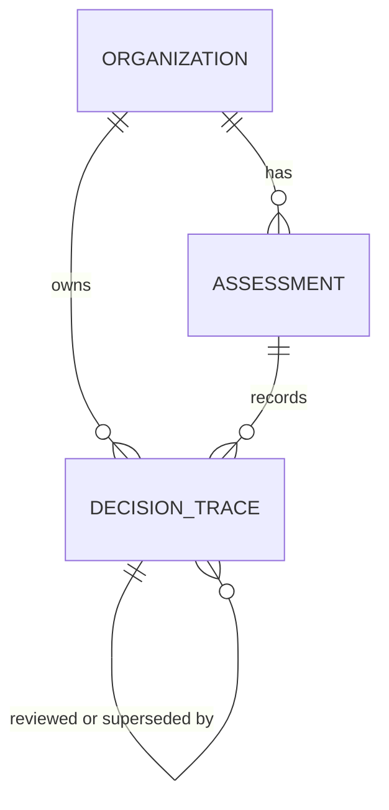

# Reasoning Trace Schema (E0-06)

| Field | Value |
| --- | --- |
| Jira | AGRC-15 (E0-06) |
| Author | Abedin Orahovac |
| Date | 2026-09-30 |
| Status | Draft, for review by the DB schema owner (Juan) and the agent developers (Natalia, Juan) |

## 1. Purpose

The reasoning trace is an **auditable record of every decision** that affects the result of an assessment. It lets a consultant, administrator or auditor reconstruct how each finding was produced: which sources were used, which rule or prompt was applied, what was decided, with what confidence, and who reviewed it.

It is **not** the model's private chain-of-thought, the chat transcript, or technical application logs.

## 2. Principles

1. **One record per decision.** A decision is anything a consultant or auditor could ask "why is this so?" about.
2. **Append-only.** Records are never updated or deleted. A changed decision creates a new record that points to the old one (`supersedes_trace_id`).
3. **Every agent decision cites at least one source.** An uncited assertion is a fabrication.
4. **Isolated by organization** at the data layer, like all other assessment data.
5. **Persists after the assessment session closes.**

## 3. Decision types

| decision_type | Meaning |
| --- | --- |
| `answer_interpreted` | A fact was derived from an interview answer |
| `evidence_extracted` | Evidence was extracted from a document or Microsoft 365 configuration |
| `evidence_validated` | Evidence was judged `provided_sufficient`, `provided_insufficient`, `documented_absence` or `not_requested` |
| `mapping_assigned` | Evidence or a finding was mapped to one or more NIST CSF 2.0 subcategories, with a justification |
| `status_assessed` | A control status was set: Implemented, Partially or Not Implemented |
| `contradiction_detected` | Two sources disagree (for example policy vs. tenant configuration) |
| `finding_generated` | A finding (gap) was created, with priority and risks |
| `human_review` | A person accepted, modified or rejected an earlier decision |

## 4. Fields

### A. Where and when
| Field | Type | Required | Description |
| --- | --- | --- | --- |
| `id` | UUID | yes | Record identifier |
| `organization_id` | UUID → organization | yes | Tenant isolation |
| `assessment_id` | UUID → assessment | yes | Assessment session |
| `created_at` | timestamp with time zone | yes | When the decision was made |

### B. What was decided
| Field | Type | Required | Description |
| --- | --- | --- | --- |
| `decision_type` | enum (section 3) | yes | Kind of decision |
| `control_ids` | text[] | no | NIST CSF 2.0 subcategory codes, e.g. `{PR.AA-03}`; several allowed (many-to-many mapping) |
| `module` | text | no | Interview module, e.g. `Access` |

### C. Based on what
| Field | Type | Required | Description |
| --- | --- | --- | --- |
| `sources` | JSON array | yes for agent decisions | Each item: `type` (`interview_turn`, `document_span`, `tenant_configuration`, `prior_phase_evidence`), `ref`, `excerpt` |
| `evidence_nature` | enum: `intent`, `implementation`, `attestation` | no | Policy (intent), configuration (implementation) or a person's statement (attestation). A policy never proves implementation. |

### D. Who decided and how
| Field | Type | Required | Description |
| --- | --- | --- | --- |
| `actor_type` | enum: `agent`, `assessed_org_representative`, `aligo_consultant` | yes | The organization confirms facts; the consultant validates judgment |
| `actor_user_id` | UUID | no | Set for human actors |
| `model_name` | text | for agent | LLM used |
| `prompt_id`, `prompt_version` | text | for agent | Prompt or deterministic rule applied (a rule uses the prefix `rule:`, e.g. `rule:risk-classification`) |
| `kb_version` | text | yes | Knowledge base version used |

### E. Result
| Field | Type | Required | Description |
| --- | --- | --- | --- |
| `output` | JSON | yes | Decision result, shape depends on `decision_type`, e.g. `{"status": "Partially"}` |
| `rationale` | text | yes | Short human-readable justification that cites the sources |
| `confidence` | number 0–1 | no | Agent confidence; empty for human decisions |
| `requires_human_review` | boolean | yes | True for uncertain or critical decisions |

### F. Review and history
| Field | Type | Required | Description |
| --- | --- | --- | --- |
| `reviews_trace_id` | UUID → decision_trace | for `human_review` | The decision being reviewed |
| `review_outcome` | enum: `accepted`, `modified`, `rejected` | for `human_review` | Outcome of the review |
| `supersedes_trace_id` | UUID → decision_trace | no | Earlier decision this record replaces |

When `review_outcome` is `modified`, the corrected result is stored in the `output` of the `human_review` record. A review is always made by a person, never by the agent.

## 5. Relationships



Table names `organization` and `assessment` are placeholders until the main DB schema (E0-02) is available.

`control_ids` stores NIST CSF 2.0 codes rather than foreign keys, because codes are stable and readable. They are validated against the knowledge base.

Format of `sources[].ref`:

| Source type | Format |
| --- | --- |
| Interview answer | `interview_turn:<id>` |
| Document | `document_span:<document_id>#page=<n>` |
| Microsoft 365 configuration | `tenant_configuration:<snapshot_id>/<path>` |
| Prior technical phase | `prior_phase_evidence:<id>` |

## 6. Reconstructing the JSON export

Only **effective** records are used: records that are not superseded and not rejected by a review.

| Export field (Aligo schema v0) | Derived from |
| --- | --- |
| `framework_mapping[]` | `mapping_assigned`: `control_ids`, `rationale`, `confidence` |
| `evidence[].state`, `validated_by` | `evidence_validated`, confirmed or changed by `human_review` |
| `sources[]` | `sources` of all records linked to the finding |
| `confidence`, `requires_human_review` | `finding_generated` |
| `review` | `human_review`: `actor_type`, `review_outcome` |
| `contradictions[]` | `contradiction_detected` |

This gives the explainability chain: subcategory → finding → evidence → source.

## 7. Access rules

| Role | Can view and export | Can change |
| --- | --- | --- |
| Organization representative | Traces of assessments of their own organization they can access | Nothing |
| Aligo consultant | Traces of assessments they work on | Nothing; adds `human_review` records |
| Platform administrator | All traces, for diagnostics | Nothing |

The application database role has only `INSERT` and `SELECT` on this table. Every query filters by `organization_id` at the data layer. The export format (JSON or CSV) is decided when the export endpoint is implemented.

## 8. Example

An agent judges a conditional access policy found in report-only mode:

```json
{
  "decision_type": "evidence_validated",
  "control_ids": ["PR.AA-03"],
  "module": "Access",
  "sources": [
    {
      "type": "tenant_configuration",
      "ref": "tenant_configuration:snap-01/conditionalAccess/require-mfa-admins",
      "excerpt": "state: enabledForReportingButNotEnforced"
    }
  ],
  "evidence_nature": "implementation",
  "actor_type": "agent",
  "model_name": "TBD (E0-04)",
  "prompt_id": "evidence-validation",
  "prompt_version": "0.1",
  "kb_version": "csf2.0-kb-0.1",
  "output": { "state": "provided_insufficient" },
  "rationale": "The policy requiring MFA for admin roles is in report-only mode, so it does not enforce MFA. Report-only policies are insufficient per the evidence rubric.",
  "confidence": 0.9,
  "requires_human_review": true
}
```

## 9. Draft PostgreSQL definition

Subject to the stack decision (E0-04) and the main DB schema (E0-02).

```sql
CREATE TYPE decision_type AS ENUM (
  'answer_interpreted', 'evidence_extracted', 'evidence_validated',
  'mapping_assigned', 'status_assessed', 'contradiction_detected',
  'finding_generated', 'human_review'
);
CREATE TYPE actor_type AS ENUM ('agent', 'assessed_org_representative', 'aligo_consultant');
CREATE TYPE evidence_nature AS ENUM ('intent', 'implementation', 'attestation');
CREATE TYPE review_outcome AS ENUM ('accepted', 'modified', 'rejected');

CREATE TABLE decision_trace (
  id                    UUID PRIMARY KEY DEFAULT gen_random_uuid(),
  organization_id       UUID NOT NULL REFERENCES organization(id),
  assessment_id         UUID NOT NULL REFERENCES assessment(id),
  created_at            TIMESTAMPTZ NOT NULL DEFAULT now(),
  decision_type         decision_type NOT NULL,
  control_ids           TEXT[] NOT NULL DEFAULT '{}',
  module                TEXT,
  sources               JSONB NOT NULL DEFAULT '[]',
  evidence_nature       evidence_nature,
  actor_type            actor_type NOT NULL,
  actor_user_id         UUID,
  model_name            TEXT,
  prompt_id             TEXT,
  prompt_version        TEXT,
  kb_version            TEXT NOT NULL,
  output                JSONB NOT NULL,
  rationale             TEXT NOT NULL,
  confidence            NUMERIC(3,2) CHECK (confidence BETWEEN 0 AND 1),
  requires_human_review BOOLEAN NOT NULL DEFAULT false,
  reviews_trace_id      UUID REFERENCES decision_trace(id),
  review_outcome        review_outcome,
  supersedes_trace_id   UUID REFERENCES decision_trace(id),

  -- sources must always be a JSON array
  CHECK (jsonb_typeof(sources) = 'array'),
  -- agent decisions must record model and prompt, and cite at least one source
  CHECK (actor_type <> 'agent'
         OR (model_name IS NOT NULL AND prompt_version IS NOT NULL
             AND jsonb_array_length(sources) >= 1)),
  -- a review must say what it reviews and its outcome
  CHECK (decision_type <> 'human_review'
         OR (reviews_trace_id IS NOT NULL AND review_outcome IS NOT NULL)),
  -- a review must be done by a person, never by the agent
  CHECK (decision_type <> 'human_review' OR actor_type <> 'agent')
);

CREATE INDEX idx_trace_org_assessment ON decision_trace (organization_id, assessment_id, created_at);
CREATE INDEX idx_trace_controls ON decision_trace USING GIN (control_ids);
```

## 10. Open questions

1. **Retention:** how long traces are kept after an assessment closes. Decision gate before real data is processed.
2. **Redaction:** whether `excerpt` must be shortened or masked for sensitive data. Decision gate before real data is processed.
3. Whether organization representatives see consultant review records or only agent decisions.
4. How the agent computes `confidence` (agent developers).
5. Final table names and ID types from the main DB schema (E0-02).
6. Enforce that `assessment_id` belongs to `organization_id` with a composite foreign key `(assessment_id, organization_id)` → `assessment(id, organization_id)`, once the main schema is available.